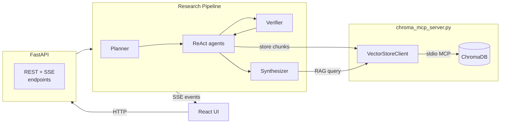

# Agentic Research Assistant

An autonomous research pipeline that breaks a topic into sub-questions, searches the web, stores grounded evidence in a vector database, runs a critic/verifier pass, and synthesizes a cited Markdown report. Includes a React UI, a FastAPI backend, and a ChromaDB MCP server that is owned and spoken to over stdio by the pipeline.

## Architecture



## Pipeline Steps

1. **Plan** — LLM breaks the topic into 3 concrete sub-questions.
2. **Research** — A ReAct agent per sub-question searches the web (`search_web`), reads pages (`read_web_page`), and stores faithful excerpts (`store_research_chunk`) into a per-session ChromaDB collection via the ChromaDB MCP server.
3. **Verify** — An LLM-only critic queries the stored chunks (again via the MCP server) against each sub-question and flags weak or missing coverage. Its feedback is fed forward into synthesis.
4. **Synthesize** — RAG over the stored chunks (queried via the MCP server) produces a structured, cited Markdown report.

Progress events stream to the client via Server-Sent Events throughout all steps. The user can inject feedback mid-run via the feedback endpoint.

## Project Structure

```
research-assistant/
├── app/
│   ├── main.py           # FastAPI app, session management, SSE, endpoints
│   ├── agent_service.py  # Pipeline: planner, sub-agents, verifier, synthesizer
│   ├── tools.py          # LangChain tools: search_web, read_web_page, store_research_chunk
│   ├── vector_store.py   # MCP client wrapper (VectorStoreClient → chroma_mcp_server)
│   └── schemas.py        # Pydantic request/response models
├── frontend/             # React + Vite UI
│   └── src/
│       └── App.jsx
├── chroma_mcp_server.py  # MCP stdio server that owns ChromaDB (spawned by the pipeline)
├── run_server.py         # Uvicorn entrypoint
└── requirements.txt
```

## Setup

### Prerequisites

- Python 3.11+
- Node.js 18+ (for the UI)
- An OpenAI API key

### Install

```bash
pip install -r requirements.txt
```

### Environment

Create a `.env` file in the project root:

```env
OPENAI_API_KEY=sk-...
OPENAI_MODEL=gpt-4o-mini        # optional, default: gpt-4o-mini
CHROMA_PERSIST_DIR=./chroma_data # optional
CORS_ORIGINS=*                   # optional
```

### Run the backend

```bash
python run_server.py
```

API available at `http://localhost:8000`. Interactive docs at `http://localhost:8000/docs`.

### Run the frontend (dev)

```bash
cd frontend
npm install
npm run dev
```

### Build the frontend (production)

```bash
cd frontend
npm run build
```

The FastAPI server will serve the built UI from `frontend/dist/`.

## API Reference

| Method | Path | Description |
|--------|------|-------------|
| `POST` | `/api/research` | Start a research session |
| `GET` | `/api/sessions/{sid}/events` | SSE stream of pipeline events |
| `POST` | `/api/sessions/{sid}/feedback` | Inject feedback mid-run |
| `GET` | `/api/sessions/{sid}/report` | Retrieve finished report (202 while pending) |
| `GET` | `/api/health` | Health check |

### `POST /api/research`

```json
{ "topic": "your research question", "session_id": "optional-existing-id" }
```

Returns `{ "session_id": "...", "status": "started" }`.

### SSE event kinds

| Kind | Description |
|------|-------------|
| `session` | Session started |
| `plan` | Subtopics decided |
| `subtopic_start` / `subtopic_end` | Per-subtopic agent progress |
| `tool_start` / `tool_end` | Individual tool calls |
| `stored` | Chunk stored in vector DB |
| `critic_start` / `critic_end` | Verifier result per subtopic |
| `synthesis` | Report synthesis started |
| `final` | Completed report (Markdown) |
| `feedback_received` / `feedback_applied` | Feedback loop events |
| `error` | Pipeline error |

## ChromaDB MCP Server

`chroma_mcp_server.py` owns the ChromaDB instance and is spawned automatically as a subprocess by the FastAPI process on startup. The pipeline never calls ChromaDB directly; all vector-store operations go through this server over stdio MCP.

Tools: `create_collection`, `add_documents`, `query_context`, `collection_count`.

The `CHROMA_PERSIST_DIR` environment variable controls where data is stored (default: `./chroma_data`).
